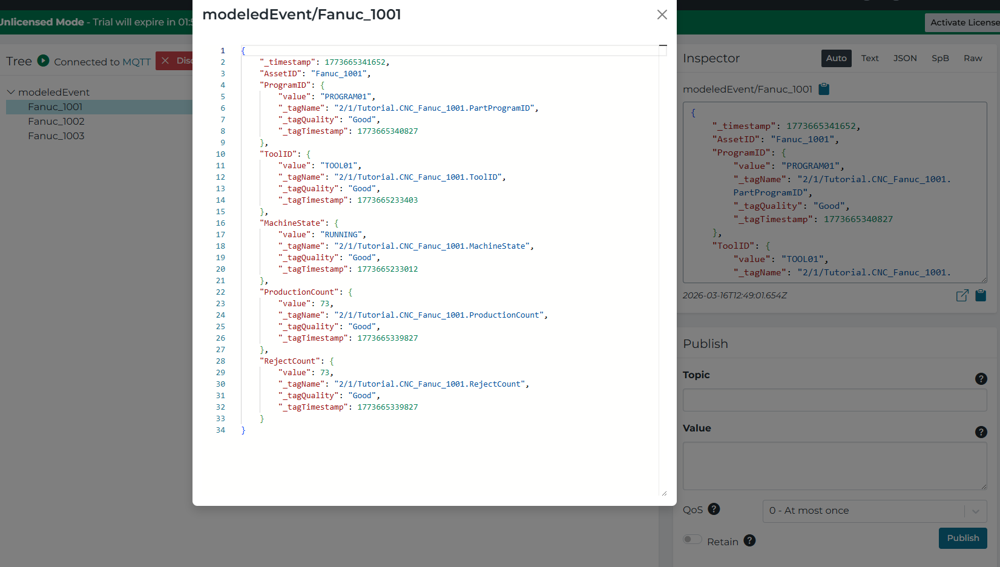

# Event driven pipelines (Event Trigger Stage)
## Setup event-driven data flows on modeled data

### Content:
- Summary
- Instructions
- Project file

### Summary:

Example project for event driving an Instance that has multiple Attributes mapped to Event Inputs.

> [!NOTE]
> From version 4.4.0, Instances can be handled as an event source and referenced in an Event Trigger.

### Instructions:
Import project file found at the bottom of this page.
This project can run on its own, but it reuses the Components from the Advanced UNS Reference Solution: https://support.highbyte.com/kb/references/starter-solutions/advanced-techniques-and-applications-for-building-unified-namespaces
View the full payload get published when one of its various attributes gets a new message:

### Project File:

Download link: [configuration.json](https://github.com/taibytedx/kb/blob/main/drafts/event-driven-pipeline/intelligencehub-configuration.json)